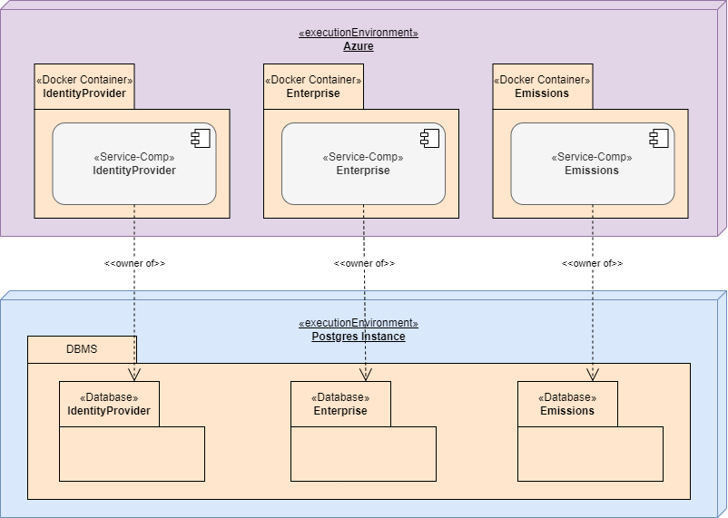

# Architecture Design Document

# 1. Introduction and objectives

## 1.1. Tasks and goals

GreenBuilding is a comprehensive, digital greenhouse gas inventory management solution tailored to the needs of
enterprises in Vietnam. Our software empowers businesses to digitize their GHG inventory process, ensuring transparency,
accuracy, and alignment with international standards.

- Responsive web client that automatically adapts to the available screen or window size
- Supported languages: English, Vietnamese, Chinese

## 1.2. Quality goals

- The response times for **service calls are usually less than 0.5 seconds**
- The solution is modular and can be **scaled horizontally**

**GreenBuildings** will have many users who use the system frequently. Therefore

- the application should load fast (**less than 2 seconds**).
- occasional users should understand the application easily.

## 1.3. Stakeholders

Table 1. **GreenBuildings** stakeholders

| **Stakeholder**            | **Stakeholder type**  | **Expectations**                                                                                                                                                                                            |
|----------------------------|-----------------------|-------------------------------------------------------------------------------------------------------------------------------------------------------------------------------------------------------------|
| Development Team           |                       | Timely deliveries of service interfaces and their specification. Support with integration problems.                                                                                                         |
| Enterprise Customers       | User category         | Use the solution for operations, resource management, and compliance reporting. Manage user roles, permissions, and configuration settings. Verify compliance, validate reports, and ensure data integrity. |
| End Customers              | Indirect Stakeholders | May indirectly benefit from the solution's efficiency, such as tenants or customers of the enterprises.                                                                                                     |
| Partners and Vendors       |                       | Providers of complementary services, such as building maintenance or utilities, who may integrate with your solution.                                                                                       |
| Investors and Stakeholders |                       | Interested in the financial performance and market penetration of the solution.                                                                                                                             |

# 3. Solution boundaries and context

## 3.1. Business context

### 3.1.1 Use Cases

Figure 2. GreenBuildings Use Cases

Table 2. Use Case categories

| **Area**                          | **Description**                                                                                                                                                                                                                                                                                                                                                                          |
|-----------------------------------|------------------------------------------------------------------------------------------------------------------------------------------------------------------------------------------------------------------------------------------------------------------------------------------------------------------------------------------------------------------------------------------|
| Identity and Subscription Service | Manages the lifecycle of users, including onboarding, role assignment, and account deactivation. Manages user login, authorization, and access control using secure protocols like OAuth2 or OpenID Connect. Defines and enforces roles and permissions for users and groups across the system. Tracks subscription plans, processes payments, and monitors usage metrics for invoicing. |
| Enterprise Management             | Enables enterprises to configure building-level details, manage users, and customize settings. Manages the lifecycle of buildings' users, including on-boarding, role assignment, and account deactivation.                                                                                                                                                                              |
| Emission Management               | Manages the allocation of resources like energy, space, and equipment across buildings. Tracks and improves energy usage to meet sustainability goals and reduce costs. Provides insights through customizable reports and ensures compliance with auditing standards.                                                                                                                   |

### 3.1.2 Business information model

TODO

Figure 3. The most important GreenBuildings entities and their relationships

| Entity | Area              | Description                                    |
|--------|-------------------|------------------------------------------------|
| Role   | Identity Provider | Every GreenBuildings user has exactly one role |
|        | Enterprise        |                                                |
|        | Subscription      |                                                |

### 3.1.3 Roles

Table 3. The GreenBuildings user roles.

| role                         | techn. name   | description                                                                                                                                                   |
|------------------------------|---------------|---------------------------------------------------------------------------------------------------------------------------------------------------------------|
| GreenBuildings Administrator | ADMINISTRATOR | Manages GreenBuildings as the person responsible for the application. Has unrestricted access to the system in terms of data, functions and parameterization. |
| Enterprise Owner             | OWNER         | Responsible for overall building operations, energy management, and cost control.                                                                             |
| …                            |               |                                                                                                                                                               |

## 3.2. Technical context

Figure 4. GreenBuildings and thirty components.

### External systems

| **Name**        | Mail Server                                                                                        |
|-----------------|----------------------------------------------------------------------------------------------------|
| Description     | Mailgun Technologies Inc is an email delivery service for sending, receiving, and tracking emails. |
| Protocol        | SMTP                                                                                               |
| Call direction  | GreenBuildings ⇒ Mailgun                                                                           |
| Data protection | SMTP AUTH                                                                                          |
| Defined by      | Mailgun                                                                                            |

| **Name**    | PayOS                                                                                |
|-------------|--------------------------------------------------------------------------------------|
| Description | payOS is a payment gateway that uses the user's own bank account to confirm payment. |
| Protocol    | REST                                                                                 |
| Direction   | GreenBuildings ⇒ payOS                                                               |
| Security    | API keys                                                                             |
| Defined by  | Casso                                                                                |

# 4. Solution strategy

## Service oriented architecture

The GreenBuildings backend is based on a Service oriented architecture. This means that:

- Business logic is implemented through several business services that focus on a specific business domain and are
  loosely coupled.
- The scope of a service component is defined by the business domain it covers.
- Each service component has its own area within the GreenBuildings database for which it is exclusively responsible.
  service components communicate with each other by providing and using JSON/rest service interfaces. When a service
  component needs to work with data that is within the responsibility of another service, it calls that other service
  through service calls.
- Services can also be used by external components. The interfaces are formally defined by using
  OpenApi ([https://www.openapis](https://www.openapis/).org/).
- All service components must allow multiple instantiation.

Service calls to and between service components are not encrypted or otherwise protected. The identity of the triggering
user is passed on from service to service (token propagation). For processes where the triggering user is not known or
applicable (e.g. time-controlled processes), a technical user is used.

## Technology stack

The technologies used in the layers (=Tiers). shows the used technologies.

The **Front end**: Angular web framework,  https://primeng.org/

The **Back end** based on Java framework such as both Quarkus & Spring Boot. This is based on Java and runs on an
OpenJDK JVM. For O/R Mapping Hibernate is used.

Figure 5. The technologies used in the layers (=Tiers).

# 5. Block view

## 5.1. The GreenBuildings overall system

Figure 6. The internal components of GreenBuildings at a glance

The internal components of GreenBuildings at a glance shows the basic structure of the GreenBuildings application:
GreenBuildings is a three-tier application with front-end, back-end and database.

- The front-end consists of a single-page application that is loaded into the user’s browser. After loading and starting
  the application, it interacts with the backend via JSON/Rest service calls. An exception is the dynamic reloading of
  modules.
- The backend consists of a group of interacting service components. These offer interfaces and usually have a
  connection to the database.
- The database contains the persistent data.

## 5.2. The web client

### Application structure

The web client is structured according to the specifications of the Angular framework. Important structural elements
are:

**Angular modules**

- Definition: Angular modules are the basic structural elements of Angular applications. They bundle related building
  blocks such as components, directives, pipes and services.
- Purpose: Angular modules structure the application and enable code reuse.

**Angular components**

- Definition: Angular components are the building blocks that make up the user interface of an Angular application.
- They define the appearance and behavior of a single user interface element.
- Purpose: Angular components define the user interface and behavior of the application.

**Angular Services**

- Definition: Angular services are responsible for the logic and data management of an Angular application. You can
  retrieve, process and store data from the backend.
- Purpose: Angular services are responsible for the application’s logic and data management.
- Rule: Angular applications should use Services to encapsulate logic and data management.

**Other structural elements**

- Angular directives are special instructions that can change the appearance or behavior of the user interface.
- Angular pipes are special functions that can format or transform data.
- Angular routing makes it possible to navigate between different views of an Angular application.

The GreenBuildings client should load quickly and be easy to use even for sporadic users. When the application is
initially loaded, only the core module is loaded. Specialist modules are dynamically reloaded if necessary. (
See [https://angular.io/guide/lazy-loading-ngmodules](https://angular.io/guide/lazy-loading-ngmodules).) The screen flow
and the dynamic modules of the GreenBuildings web application shows the expected screens, their transitions and their
division into dynamic modules.

### Technologies

The web client is implemented based on the following software stack:

Table 4. The web client’s software stack

| Component | Description                                                                 | link                                                         |
|-----------|-----------------------------------------------------------------------------|--------------------------------------------------------------|
| Angular   | Widely used web framework for creating so-called “single page” applications | [https://angular.dev/overview](https://angular.dev/overview) |
| PrimeNG   | Component library for Angular                                               | [https://primeng.org](https://primeng.org/)                  |

TypeScript is used as the implementation language.

The Angular Framework offers or integrates standardized modules for most common aspects:

Table 5. Some aspects that are covered by the Angular Framework

| **aspect**            | **Recommended solution** |
|-----------------------|--------------------------|
| Routing               | Angular Routing          |
| Internationalization  | ngx-translate            |
| Authentication (OIDC) | angular-auth-oidc-client |

### Mobile clients

Any user with internet access, theoretically can register for GreenBuildings and use it. Therefore all commonly used
devices, i.e. web-browsers, iOS Android tablets and mobile phones have to be supported.

A one code base approach is used: GreenBuildings is implemented as a progressive web app (PWA,
see [https://en.wikipedia.org/wiki/Progressive_web_app](https://en.wikipedia.org/wiki/Progressive_web_app)
or [https://angular.dev/ecosystem/service-workers/getting-started](https://angular.dev/ecosystem/service-workers/getting-started)).
Screens use a **reactive design** that adapts to various screen sizes automatically. (If, for some views, CSS styling
does not cover satisfactorily mobile and desktop, specialized views are created for the respective devices.)

On mobile devices, the GreenBuildings client behaves like a true mobile app. The GreenBuildings PWA is published on the
common app stores via PWABuilder ([https://www.pwabuilder.com/](https://www.pwabuilder.com/)).

## 5.3. The GreenBuildings backend

### Application structure

The GreenBuildings backend consists of a group of service components, all of which are built according to a similar
principle. Quarkus and Spring Boot is used as the base framework. The structure of a business service is partially given
by the Quarkus and Spring Boot framework. The following structural elements are normally involved when answering a
service call:

Table 6. Structural elements of Quarkus Business Services

| Element                      | Annotation                       | Name           | Description                                                                                                                                     |
|------------------------------|----------------------------------|----------------|-------------------------------------------------------------------------------------------------------------------------------------------------|
| JSON/Rest Service Interfaces | @Path, @Get, etc.                | *Resource.java | Implements the interpretation of the JSON calls and the provision of the results.                                                               |
| Service implementation       | @ApplicationScoped               | *Service.java  | Implements the actual business logic. Methods of a service implementation usually represent a transaction bracket.                              |
| Data access                  | … implements PanacheRepository<> | *Repository    | Implement a transparent, easy-to-use API for data access to the database. (The “repositories” use Quarkus-Panache)                              |
| O/R Entity                   | @Entity                          | *Entity.java   | Object representation of the relational database data. Typically an entity corresponds to a table. An Entity object corresponds to a table row. |

and Spring Boot:

| Element                      | Annotation                         | Name             | Description                                                                                                                                     |
|------------------------------|------------------------------------|------------------|-------------------------------------------------------------------------------------------------------------------------------------------------|
| JSON/Rest Service Interfaces | @RestController, @GetMapping, etc. | *Controller.java | Implements the interpretation of the JSON calls and the provision of the results.                                                               |
| Service implementation       | @Service                           | *Service.java    | Implements the actual business logic. Methods of a service implementation usually represent a transaction bracket.                              |
| Data access                  | … implements JpaRepository<>       | *Repository      | Implement a transparent, easy-to-use API for data access to the database. (The “repositories” use Spring JPA Repository)                        |
| O/R Entity                   | @Entity                            | *Entity.java     | Object representation of the relational database data. Typically an entity corresponds to a table. An Entity object corresponds to a table row. |

### Technologies

Table 7. The aspects covered by the Quark framework and its extensions

| aspect               | Quarkus expansion                                      | Spring                    |
|----------------------|--------------------------------------------------------|---------------------------|
| JSON/Rest Services   | quarkus-resteasy, quarkus-resteasy-jackson             |                           |
| XML/Rest Services    | quarkus-resteasy-jaxb                                  |                           |
| Database, SQL        |                                                        |                           |
| O/R mapping          | quarkus-hibernate-panache, quarkus-hibernate           |                           |
| Query                | just use JPA Criteria in dynamic                       | JPQL queries and Criteria |
| Authentication       | quarkus-oidc                                           |                           |
| Identity Propagation | quarkus-smallrye-jwt                                   |                           |
| Security context     | quarkus-security, quarkus-smallrye-context-propagation | spring security           |
| Health service       | quarkus health                                         |                           |
| Database migration   | quarkus flyway                                         | flyway                    |
| Template engine      | quarkus-freemarker                                     | Thymeleaf                 |

### Definition of the service interfaces

The business services offer their functionality via a JSON/REST interface. When designing interfaces, the following
principles are applied:
**"Front-End First"**
The design of the API functions focuses on the needs of the GreenBuildings Front-End. This means that the interfaces
functions allow building and updating views by calling only a few service.

**"Code First"**
The APIs are first implemented in the form of Java classes. The Openapi specification is derived from the
implementation. The “Quarkus Smallrye Openapi” library optimally supports this workflow. (see
e.g. [https://quarkus.io/blog/openapi-for-everyone/](https://quarkus.io/blog/openapi-for-everyone/))

### Service component responsibilities

Each backend service component covers a specific technical area

Table 8. The technical responsibility of the service components

| Name                                    | Technical name | Area of responsibility                                                                                                                                                                                                                                                                                                                |
|-----------------------------------------|----------------|---------------------------------------------------------------------------------------------------------------------------------------------------------------------------------------------------------------------------------------------------------------------------------------------------------------------------------------|
| Identity and Subscription Service (ISS) | iss            | centralized authentication and authorization using OIDC and handle plans for enterprise subscriptions (e.g., free trial, premium), manage payment workflows and track billing history, enforce feature access based on subscription tiers.                                                                                            |
| Enterprise Management                   | enterprises    | manage building-related data and configurations. Focused solely on backend functionality for managing enterprise-related data. Generate reports for GHG inventories, emissions data, and reduction targets, provide report formats aligned with certification requirements, allow exporting data for submission to regulatory bodies. |
| Emission Management                     | emissions      | Perform calculations for GHG emissions based on operational data, provide APIs to calculate emissions in compliance with standards (e.g., ISO 14064, GHG Protocol), maintain formulas and coefficients for emissions calculations.                                                                                                    |

TODO

Figure 8. The service components and their responsibilities for specific use cases

TODO

Figure 9. The service components and their responsibilities for business entities.

### Cascading service calls

The service components have clear responsibilities and are designed to minimize coupling. Nevertheless, involvement of
several services for one service request will be necessary in some cases. The following rules are applied:

**Service interfaces**
The services use JSON/Rest for internal communication. There is no technical difference between external and internal
service interfaces.

**Identity propagation**
The identity of a user is passed on from one service to the next (see also ). Each Security features of the service
components service execution therefore runs with a defined identity (in the case of batch processes, this can be a
technical user).

**Service correlation**
Correlation IDs support tracking of cascading service calls. The first called service creates such an ID and forwards it
to subsequent services by setting and HTTP header.

**Distributed transactions**
GreenBuildings does not use distributed transactions (no "two-phase commits" such as saga). While this is not a problem
for read services, for updating services, distributed updates should be avoided whenever possible. When not possible,
compensation operations must be used.

### Parallelism

GreenBuildings generally uses "**optimistic locking**". This means that the application allows the same object to be
loaded concurrently from multiple clients or views. When the user tries to save an object, the system checks whether it
has remained unchanged since it was loaded. If yes, the save is successful, if no, an error message is displayed to the
user. We need the define the exact mechanism to be used for optimistic locking.

"Optimistic locking" must be implemented keeping in mind that each service component will be instantiated multiple
times. It therefore has to be based on database functionalities.

### Service components and database

The service oriented architecture requires that each service component manages its own data. Direct access to data from
other services is not permitted. Loose coupling and independent release cycles are only possible if these rules are
adhered to.

However, this architecture also involves some risks:

- The creation of many "databases" leads to increased resource consumption and increased administrative effort.
- A few aggregating use cases may require data from multiple business services. They therefore lead to a large number of
  service calls, application joins and performance problems.
- Data consistency cannot be ensured across component boundaries using constraints.

To avoid these problems, a hybrid model is proposed:

- A database instance and a database are created for GreenBuildings.
- Each service component has its own database instance. Each service includes the flyway scripts for configuring the
  database objects within the database.
- A service component may only update its own data (i.e. data within its own database).

Even in the hybrid model, the following rules remain:

- Each database object has a service component as owner.
- The service components are responsible for updating the database assigned to them.
- Write operations are carried out exclusively by the responsible component.

Figure 10. Each service component has its own database schema.

# 6. Runtime view

GreenBuildings is an online application. Most user or system calls are processed in interactive mode. There are
currently no known batch processes.

GreenBuildings implements a service-oriented architecture. Data from other applications is obtained via services when
required. Local copies of data are avoided. An interactive query can result in a cascade of multiple service calls.

# 7. Distribution view

## 7.1. Deployment

### 7.1.1. Backend

The services are made accessible from outside (= “exposed”) using an Nginx as Reserve Proxy. The Nginx also defines TLS
termination of the client connection.

TODO

Figure 12. The Docker container and the GreenBuildings multi modules

### 7.1.2. Database

Postgres is used as the database management system

The configuration of the database objects (tables, views), etc. is the responsibility of the respective service
components.

The *flyway* library is used for the management of the database structure.

### Large objects

Files or other binary data are persisted using a [Min.io](http://min.io/) object store. They are not stored as a Blob in
the GreenBuildings database.

## 7.2. Scalability

The services offered by the service components are stateless. This basically means that no state information is held
within the memory of an individual service. This rule ensures that each service can be instantiated multiple times.

Scaling the database is within the responsibility of the database team.

## 7.3. Logging

The service components use the Logback logging framework ( [https://logback.qos.ch/](https://logback.qos.ch/)). Logback
allows flexible customization of log output.

In addition to the normal log, an access log is created. This records all service calls, at least their URL and time of
access.

## 7.5. Monitoring

The service components offer a health service. This is based on the Quarkus standard module "quarkus-smallrye-health”.
The service offers, among other things:

**../q/health/started**

Shows whether the component has started.

**../q/health/ready**

Indicates whether the component can now answer service calls.

**../q/health/live**

Indicates whether the component is healthy. The availability of peripheral systems is also covered by this check. Custom
“liveness health checks” will check the surrounding systems.

The health checks must be available to callers without authentication. However, they should not be visible to callers
from outside the Azure cluster.

# 8. Cross-sectional concepts

## 8.1. UX principles

- When operating GreenBuildings, the user can see where he/she is at the moment. Possible action are clearly visible.
- The controls are arranged such that the most common ones catch the eye first. The application is therefore easy to
  understand even for less experienced users.
- Frequently used functions should be easy to find and quickly accessible.
- The application implements a “responsive design”. Operating elements are arranged and scaled differently depending on
  the available screen size. The application can be easily used on mobile devices.
- User input is validated. In the event of invalid entries, an error message and instructions on how to proceed are
  displayed.
- Additional help is provided to the user for controls that may not be self-explanatory.
- Control elements that represent operations for which the current user does not have authorization are hidden. The
  visible elements correspond to the role of the user.
- Control elements that represent operations that are not useful and applicable due to the current status of the
  application are displayed as inactive.
- The application’s wording respects the terminology of its users.

## 8.2. Internationalization

The internationalization of texts is implemented on the web client. The `ngx-translate` library is used for this
purpose.

Frequently occurring text fragments, e.g. labels of input fields, are prefixed with "common" label. This guarantees that
they are used consistently through the application.

For easier assignment of texts to labels, an additional pseudo language is offered to users with administrator
permissions. The pseudo language, called "IDS" displays the language keys instead of translated texts.

## 8.3. Security architecture

### 8.3.1. Authentication and authorization

Only authenticated and authorized persons have access to GreenBuildings. Authorization and authentication are
implemented according to the OIDC standard. A user who has not yet been authenticated is forwarded to the authorization
server Identity Provider. Identity Provider authenticates the user and creates an authorization grant, which is
delivered to the GreenBuildings client. The GreenBuildings client asks the server to convert this into an access token.
The access token is a JWT that contains the user’s identity and his roles according to Identity Provider.

The overall process corresponds to an OAUTH2 “Authorization code flow with PKCE".

Figure 13. The interactions when a registered user logs in.

### 8.3.2 Role model

The essential GreenBuildings roles are described in Roles. A distinction must be made between:

**Roles**
Allow the user to perform specific functions.

**Permissions**
Allow the user to perform operations on specific objects

Permissions and roles are always additive. That is, they allow something. Roles or permissions that restrict or prohibit
something are not used in GreenBuildings.

### 8.3.3 Web client security features

The web client generally only shows elements and data to the user if he has the necessary roles and permissions to see
and use them.

The client checks whether the necessary role is present in the user
token. ([https://angular.io/api/router/CanActivate](https://angular.io/api/router/CanActivate))

The *permissions* usually do not have to be checked by the web client, as this check is the responsibility of the
service components.

Among others, the client implements the following security mechanisms:

- The client implements protection against cross-site scripting through input validation and sanitizing of the input
  fields. User input is never used as part of the executable code.
- The client implements protection against CSRF
  attacks [https://angular.io/guide/http-security-xsrf-protection](https://angular.io/guide/http-security-xsrf-protection)

### 8.3.4 Security features of the service components

The service components do not trust service callers. This means that they always check the JWT provided by the caller
and make sure that the user has the necessary rights to carry out the requested operation. The service components filter
the results of queries according to data records for which the caller has access rights.

Authentication: For JSON/Rest calls, a JWT token is required, which is checked for validity by the service component.
The token contains the identity of the calling user and their roles
see [https://quarkus.io/guides/security-openid-connect-client](https://quarkus.io/guides/security-openid-connect-client).

**Roles**
Are preferably checked via security annotations on the service methods.
See [https://quarkus.io/guides/security-jwt](https://quarkus.io/guides/security-jwt)

**Permissions**
Are usually checked by queries on the database. The exact design of the rights check is currently still being discussed.
In this way, part of the permissions should be reflected in the JWT token.

Cascading service calls: When using cascading calls, the JWT tokens are forwarded from one service to the next - token
propagation.

### 8.3.5. Best practices

GreenBuildings implements appropriate counter measures against "OWASP Top 10" risks.

# 9. Architecture decisions

Table 9. Architectural decisions

| Question                               | decision                                            | Reason                                                                                                                                                                                                                                                                     |
|----------------------------------------|-----------------------------------------------------|----------------------------------------------------------------------------------------------------------------------------------------------------------------------------------------------------------------------------------------------------------------------------|
| Base technology for the backend        | A software stack based on Java is used.             | Less project risk, as experienced team members are available for this software stack.                                                                                                                                                                                      |
| Base technology for the front end      | A software stack based on PrimeNG /Angular is used. | Stronger support for implementing common UI functions. Less project risk, as experienced team members are available for this software stack.                                                                                                                               |
| Possible Conflicts with Parallel Users | Optimistic locking is used.                         | We expect few conflicts from parallel users. Optimistic Locking means the least intrusive restriction.                                                                                                                                                                     |
| Storage of document s or Blobs         | The blobs are stored in the min.io document store.  | Storing many blobs in the database makes complicated its operation. For example, DB backups become significantly heavier.                                                                                                                                                  |
| Native code                            | Native code is used                                 | Fast Startup Times, Reduced Memory Footprint, and No Need for Long Warm-Up.                                                                                                                                                                                                |
| Reactive programming                   | Reactive programming is not used in some modules    | Quarkus supports the intensive use of "reactive programming", but using it adds additional complexity to implementation and results in code that is harder to read. The introduction of "local threads" with Java 21 may result in "reactive programming" become obsolete. |

# 10. Technical Risks and technical debts

Table 10. The technical risks

| Possible problem                                              | Probability of occurrence | Countermeasures                                                                                        |
|---------------------------------------------------------------|---------------------------|--------------------------------------------------------------------------------------------------------|
| Performance problems of the service components of components. | Medium                    | Regular performance reviews. Use of caches. Horizontal scaling                                         |
| Performance problems on the database                          | Medium                    | Regular performance reviews. Optimization of SQL statements. Use of caches. Use of table partitioning. |

At the moment there are no known technical debts.
