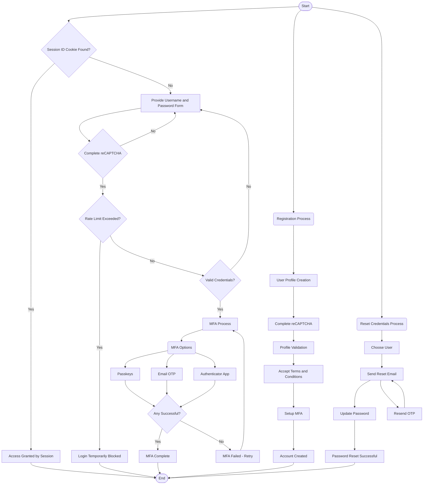

# User Authentication

**Status**: Ready for UI/UX design

**Priority / Business Value**: High

# 1. Content

1. Content
2. Objective
3. Overview / Background
    1. Process Overview
4. Requirements
    1. User Story: Browser Login
    2. User Story: Registration
    3. User Story: Reset Credentials
    4. User Story: Browser Logout
    5. User story: OIDC client login with `openid` scope included subscription plan in the token

# 2. Objective

Enable secure access using OIDC standards.

# 3. Overview / Background

## 3.1 Process Overview



# 4. Requirements

## 4.1 User story: Browser Login

**Objective**: **As a** user, **I want to** securely log in to the application using a web browser with MFA

**Context**: User navigates to the login page and enters their credentials

**Precondition**: None

**User Interface**: [Figma](https://www.figma.com/design/orj26nfd0gARt2SHJ8Ajox/Green-Building?node-id=2669-9848)

**Translations**:

EN:

```json
{
  "IDP": {
    "login": {
      "title": "Sign in to your account",
      "label": {
        "usernameOrEmail": "Username or email",
        "password": "Password",
        "newUser": "New user?"
      },
      "btn": {
        "login": "Sign in",
        "forgotPassword": "Forgot password",
        "register": "Register",
        "signInByPasskey": "Sign in with a passkey"
      },
      "error": {
        "badCredentials": "Invalid username or password.",
        "rateLimited": "Too many login attempts. Please try again later.",
        "recaptchaRequired": "Please complete the reCAPTCHA challenge."
      }
    }
  }
}
```

VI:

```json
{
  "IDP": {
    "login": {
      "title": "Đăng nhập vào tài khoản của bạn",
      "label": {
        "usernameOrEmail": "Tên người dùng hoặc email",
        "password": "Mật khẩu",
        "newUser": "Người dùng mới?"
      },
      "btn": {
        "login": "Đăng nhập",
        "forgotPassword": "Quên mật khẩu",
        "register": "Đăng ký",
        "signInByPasskey": "Đăng nhập bằng passkey"
      },
      "error": {
        "badCredentials": "Tên người dùng hoặc mật khẩu không hợp lệ.",
        "rateLimited": "Bạn đã vượt quá số lần đăng nhập. Vui lòng thử lại sau",
        "recaptchaRequired": "Xin vui lòng xác minh reCAPTCHA để tiếp tục."
      }
    }
  }
}
```

### Business rules

| ID                | Name                                              | Description                                                                       |
|-------------------|---------------------------------------------------|-----------------------------------------------------------------------------------|
| **AUTH_LOGIN_01** | **SCENARIO: User is in valid session**            | Direct user to the application dashboard.                                         |
| **AUTH_LOGIN_02** | **SCENARIO: Invalid session**                     | Prompt user to log page                                                           |
| **AUTH_LOGIN_03** | **SCENARIO: Invalid credentials**                 | Prompt user to re-enter credentials                                               |
| **AUTH_LOGIN_04** | **SCENARIO: Rate limit exceeded**                 | Block user from logging in                                                        |
| **AUTH_LOGIN_05** | **SCENARIO: Valid credentials <br> MFA required** | We provide MFA options: <br> - Passkeys <br> - Email OTP <br> - Authenticator App |
| **AUTH_LOGIN_06** | **SCENARIO: MFA successful**                      | Direct user to the application dashboard                                          |
| **AUTH_LOGIN_07** | **SCENARIO: MFA failed**                          | Prompt user to retry MFA process                                                  |
| **AUTH_LOGIN_08** | **SCENARIO: reCAPTCHA required**                  | Prompt user to complete reCAPTCHA before proceeding                               |

## 4.2 User story: Registration

**Objective**: **As a** enterprise owner, **I want to** create an enterprise account

**Context**: User navigates to the registration page and enters their details

**Precondition**: Non-existent user profile

**User Interface**: [Figma](https://www.figma.com/design/orj26nfd0gARt2SHJ8Ajox/Green-Building?node-id=2669-9848)

**Translations**:

EN:

```json
{
  "IDP": {
    "registration": {
      "title": "Register",
      "label": {
        "username": "Username",
        "password": "Password",
        "confirmPassword": "Confirm password",
        "email": "Email",
        "companyName": "Company name",
        "hotline": "Hotline"
      },
      "btn": {
        "register": "Register",
        "back": "Back to Login"
      },
      "error": {
        "emailExists": "Email already exists.",
        "usernameExists": "Username already exists.",
        "passwordMismatch": "Password confirmation doesn't match.",
        "passwordWeak": "Password must contain at least 8 characters, one uppercase letter, one lowercase letter, one number,and one special character.",
        "recaptchaRequired": "Please complete the reCAPTCHA challenge."
      }
    }
  },
  "validation": {
    "required": "This field is required.",
    "email": "Invalid email address."
  }
}
```

VI:

```json
{
  "IDP": {
    "registration": {
      "title": "Đăng ký",
      "label": {
        "username": "Tên người dùng",
        "password": "Mật khẩu",
        "confirmPassword": "Xác nhận mật khẩu",
        "email": "Email",
        "companyName": "Tên công ty",
        "hotline": "Hotline"
      },
      "btn": {
        "register": "Đăng ký",
        "back": "Quay lại trang đăng nhập"
      },
      "error": {
        "emailExists": "Email đã tồn tại.",
        "usernameExists": "Tên người dùng đã tồn tại.",
        "passwordMismatch": "Mật khẩu không trùng khớp.",
        "passwordWeak": "Mật khẩu phải chứa ít nhất 8 ký tự, một chữ cái viết hoa, một chữ cái viết thường, một số và một kýtự đặc biệt.",
        "recaptchaRequired": "Xin vui lòng xác minh reCAPTCHA để tiếp tục."
      }
    }
  },
  "validation": {
    "required": "Trường này là bắt buộc.",
    "email": "Địa chỉ email không hợp lệ."
  }
}
```

### Business rules

**Validations**:

- Email validate can be used Angular default or Jakarta Validation.
- Username validate: 6-32 characters, no special characters.
- Password validate: 8-32 characters, at least 1 uppercase, 1 lowercase, 1 number, 1 special character.

| ID              | Name                                                                   | Description                                                                   |
|-----------------|------------------------------------------------------------------------|-------------------------------------------------------------------------------|
| **AUTH_REG_01** | **SCENARIO: Happy path <br> Profile created successfully**             | Redirect user to login page.                                                  |
| **AUTH_REG_02** | **SCENARIO: Username exists**                                          | Show error message below username field                                       |
| **AUTH_REG_03** | **SCENARIO: Email exists**                                             | Show error message below email field                                          |
| **AUTH_REG_04** | **SCENARIO: Password mismatch**                                        | Show error message below confirm password                                     |
| **AUTH_REG_05** | **SCENARIO: Weak password**                                            | Show error message below password field                                       |
| **AUTH_REG_06** | **SCENARIO: reCAPTCHA required**                                       | Show error message below reCAPTCHA checkbox                                   |
| **AUTH_REG_07** | **SCENARIO: Profile created but MFA setup failed or T&C not accepted** | **Remember user's profile and prompt to retry at step MFA or T&C acceptance** |

## 4.3 User story: Reset Credentials

**Objective**: **As a** enterprise owner, **I want to** reset my password

**Context**: User navigates to the password reset page and enters their email

**Precondition**: User profile exists

**User Interface**: [Figma](https://www.figma.com/design/orj26nfd0gARt2SHJ8Ajox/Green-Building?node-id=2669-9848)

**Translations**:

EN:

```json
{
  "IDP": {
    "reset": {
      "title": "Reset Password",
      "label": {
        "email": "Email",
        "otp": "One-time password",
        "password": "Password",
        "confirmPassword": "Confirm password"
      },
      "btn": {
        "sendOtp": "Send OTP",
        "reset": "Reset Password"
      },
      "error": {
        "userNotFound": "User not found.",
        "otpExpired": "OTP expired or invalid.",
        "passwordSame": "Password must be different from the previous one.",
        "passwordWeak": "Password must contain at least 8 characters, one uppercase letter, one lowercase letter, one number, and one special character.",
        "otpExceedLimit": "You have exceeded the OTP send limit for today.",
        "otpInvalid": "Invalid OTP.",
        "otpInvalidExceed": "You have exceeded the OTP validation for this OTP. Please request a new one."
      }
    }
  }
}   
```

VI:

```json
{
  "IDP": {
    "reset": {
      "title": "Đặt lại mật khẩu",
      "label": {
        "email": "Email",
        "otp": "Mã OTP",
        "password": "Mật khẩu",
        "confirmPassword": "Xác nhận mật khẩu"
      },
      "btn": {
        "sendOtp": "Gửi OTP",
        "reset": "Đặt lại mật khẩu"
      },
      "error": {
        "userNotFound": "Người dùng không tồn tại.",
        "otpExpired": "OTP hết hạn hoặc không hợp lệ.",
        "passwordSame": "Mật khẩu phải khác với mật khẩu trước.",
        "passwordWeak": "Mật khẩu phải chứa ít nhất 8 ký tự, một chữ cái viết hoa, một chữ cái viết thường, một số và một ký tự đặc biệt.",
        "otpExceedLimit": "Bạn đã đạt giới hạn số lần gửi OTP hôm nay.",
        "otpInvalid": "OTP không hợp lệ.",
        "otpInvalidExceed": "Bạn đã vượt quá số lần xác minh cho mã OTP này. Vui lòng yêu cầu mã mới."
      }
    }
  }
}
```

### Business rules

**Validations**:

- Password can not be the same as the previous password.
- Password validate: 8-32 characters, at least 1 uppercase, 1 lowercase, 1 number, 1 special character.

| ID                | Name                                                    | Description                                                                     |
|-------------------|---------------------------------------------------------|---------------------------------------------------------------------------------|
| **AUTH_RESET_01** | **SCENARIO: Happy path <br> Password reset successful** | Redirect user to login page                                                     |
| **AUTH_RESET_02** | **SCENARIO: User not found**                            | Show error message below username or email field                                |
| **AUTH_RESET_03** | **SCENARIO: OTP expired or invalid**                    | Show error message below OTP field. Each OTP have expire time is 24h.           |
| **AUTH_RESET_04** | **SCENARIO: Password was the same as previous**         | Show error message below password field                                         |
| **AUTH_RESET_05** | **SCENARIO: Password too weak**                         | Show error message below password field                                         |
| **AUTH_RESET_06** | **SCENARIO: OTP send exceed limit in a day**            | Show error message below OTP field. Each user can only send 3 OTPs per day      |
| **AUTH_RESET_07** | **SCENARIO: OTP invalid too much**                      | Show error message below OTP field. Each user can only try 3 times for each OTP |

### **4.4 User Story: Browser Logout**

**Objective**:  
**As a** user, **I want to** securely log out from my account on the browser to end my session.

**Context**:  
User clicks the logout button from the application dashboard.

**Precondition**:  
User is logged in and has an active session.

**User Interface**:  
[Figma](https://www.figma.com/design/orj26nfd0gARt2SHJ8Ajox/Green-Building?node-id=2669-9848)

**Translations**:

EN:

```json
{
  "IDP": {
    "logout": {
      "title": "Logout",
      "confirmMessage": "Are you sure you want to log out?",
      "btn": {
        "logout": "Log out",
        "cancel": "Cancel"
      },
      "successMessage": "You have been logged out successfully."
    }
  }
}
```

VI:

```json
{
  "IDP": {
    "logout": {
      "title": "Đăng xuất",
      "confirmMessage": "Bạn có chắc chắn muốn đăng xuất không?",
      "btn": {
        "logout": "Đăng xuất",
        "cancel": "Hủy bỏ"
      },
      "successMessage": "Bạn đã đăng xuất thành công."
    }
  }
}
```

**Business Rules**:

| ID                 | Name                               | Description                                                   |
|--------------------|------------------------------------|---------------------------------------------------------------|
| **AUTH_LOGOUT_01** | **SCENARIO: User clicks logout**   | Revoke session ID cookie and clear browser storage.           |
| **AUTH_LOGOUT_02** | **SCENARIO: User confirms logout** | Redirect user to the login page with a confirmation message.  |
| **AUTH_LOGOUT_03** | **SCENARIO: User cancels logout**  | Return user to the application dashboard without logging out. |
| **AUTH_LOGOUT_04** | **SCENARIO: Logout error**         | Show an error message if the logout process fails.            |

---

### **4.5 User Story: OIDC Client Login with `openid` Scope Including Subscription Plan**

**Objective**:  
**As an** OIDC client application, **I want to** log in the user and retrieve a token containing the `openid` scope and their
subscription plan to personalize the application experience.

**Context**:  
An OIDC client requests an access token and ID token from the identity provider, including user subscription information.

**Precondition**:  
The user has an active subscription linked to their account.

**User Interface**:  
No direct UI; this flow occurs programmatically between the client application and the identity provider.

**Business Rules**:

| ID                | Name                                                | Description                                                                               |
|-------------------|-----------------------------------------------------|-------------------------------------------------------------------------------------------|
| **OIDC_LOGIN_01** | **SCENARIO: Token request includes `openid` scope** | Return an ID token and access token with user claims, including `subscription` attribute. |
| **OIDC_LOGIN_02** | **SCENARIO: User lacks a subscription plan**        | Return tokens without `subscription` or with default subscription plan information.       |
| **OIDC_LOGIN_03** | **SCENARIO: Invalid `openid` scope**                | Reject the request with an error indicating unsupported scope.                            |
| **OIDC_LOGIN_04** | **SCENARIO: Subscription plan expired**             | Return tokens without `subscription` or with default subscription plan information.       |

**Example Token Payload**:

```json
{
  "sub": "user123",
  "name": "John Doe",
  "email": "john.doe@example.com",
  "subscription": "premium",
  "iat": 1700000000,
  "exp": 1700086400,
  "scope": "openid"
}
```
